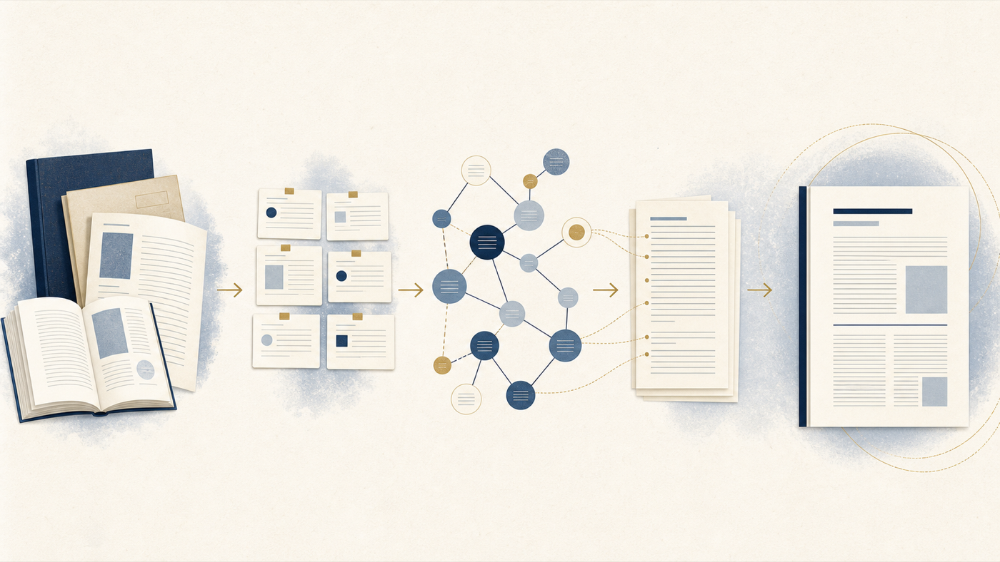

<p align="center">
  
</p>

<h1 align="center">中国法学论文写作 Skill</h1>

<p align="center">
  <em>Chinese Legal Journal Writing Skill</em><br>
  为中国法学期刊论文提供可追溯的证据链、完整引注与经核验的目标期刊适配流程。
</p>

<div align="center">


[](LICENSE)

</div>

<p align="center">
  <a href="#为什么使用">为什么使用</a> ·
  <a href="#快速安装">快速安装</a> ·
  <a href="#使用指南">使用指南</a> ·
  <a href="#与-obsidian-配合">Obsidian</a> ·
  <a href="#适用范围">适用范围</a>
</p>

<div align="center">

> **当前版本：v4.0.0（2026-08）**
>
> v4.0.0 已吸收原独立技能：`five-questions-framework`（五问需求拆解）、`legal-paper-argumentation`（推理链完整性/群案统计口径/改稿继承执行细则）、`academic-paper-docx`（投稿 docx 生产）。原内容完整保留在 `references/` 下：
> - `references/five-questions-framework.md`
> - `references/argumentation-details.md`
> - `references/docx-production.md`（配套脚本 `scripts/md2docx_footnotes.py`）
>
> 核心纪律（user confirmed 2026-08）：反说纪律（实证归纳在前）、逻辑链完整性纪律（禁断言）、标点纪律（正文禁破折号）、版本管理纪律（内容迭代即升号）。

</div>

## 为什么使用

| 研究问题先行 | 每项主张可回溯 | 交付前有门禁 |
|---|---|---|
| 从一个可论证的主问题出发，明确研究范围、反方观点和真正的学术增量。 | 将正文主张连接到来源编号、原始资料与精确位置，而非在文末堆砌文献。 | 区分工作稿与最终稿；法律时效、引注、匿名和期刊要求均须完成核验。 |

## 核心能力

- 按选题诊断、研究、提纲、起草、修改、审核和期刊适配切换任务模式，不把局部任务拉成固定流水线。
- 建立“主问题—分节主张—证据—引注—结论”链条，并记录重要反方材料与证据局限。
- 区分法律规范、司法解释、会议纪要、案例、政策、数据与学术文献的真实身份、版本和核验状态。
- 用稳定来源编号和正文脚注标识生成可继续编辑的工作稿；资料不完整时保留待核，而非补全。
- 根据目标期刊的正式、现行要求逐项适配篇幅、摘要、关键词、匿名、引注与投稿事项。
- 仅在用户指定范围内配合 Obsidian 资料；读取授权不等于写回授权。

详细行为规则见 [SKILL.md](SKILL.md)。

## 工作流程

```text
PLAN → RESEARCH → OUTLINE → DRAFT → REVISE → AUDIT
```

| 阶段 | 关键动作 | 可交付物 |
|---|---|---|
| `PLAN` | 收窄主问题、范围与资料边界 | 论文项目卡、待确认事项 |
| `RESEARCH` | 分类材料并核验身份、版本、定位 | 来源登记、证据缺口 |
| `OUTLINE` | 将章节主张连接到证据与反方材料 | 三级提纲、论点—证据—引注表 |
| `DRAFT` | 分节论证并同步设置脚注标识 | 带待核项的工作稿 |
| `REVISE` | 分别修订论证、结构与表达 | 修订稿、限制说明 |
| `AUDIT` | 双向检查引注、法律时效与投稿条件 | 可交付的最终稿或待核清单 |

`ADAPT` 是目标期刊已明确、要求已有正式来源且逐项核验后的适配模式；它可以在上述任一相关阶段介入，但不应替代审核。

## 真实性与引用边界

> 不得编造引用、页码、案号、法条或期刊要求。资料不完整时，保留 `[待核]`、缩窄表述或删除；不得把工作稿伪装成最终稿。

- 每一项他人观点、引语、数据、案例、法律规范和非一般常识的外部事实，都应在对应正文后设置引注标识。
- 最终稿中的来源性主张只能使用 `VERIFIED` 来源；`PARTIAL`、`LEAD_ONLY` 与 `UNUSABLE` 只能用于继续核查，不能静默升级。
- CSSCI 是来源期刊评价体系，不是统一投稿格式。未核验目标期刊正式要求时，只能交付通用工作稿。
- `[[Obsidian 双链]]`、文件名和本地路径只用于内部追踪，不能替代正式脚注，也不应出现在公开稿件中。

## 快速安装

### 当前优化分支

分支尚未合并到 `main` 时，请按[仓库根目录的当前分支安装说明](../README.md#current-branch-install)，复制完整的 `chinese-law-paper-writing` 目录；这样 `references/`、模板和 DOCX 脚本会一并安装。

### Hermes Agent（合并到 `main` 后）

```bash
hermes skills install shawndeng321/hermes-obsidian-legal-cssci-wiki-writing-skills/chinese-law-paper-writing
```

脚本或 CI 环境加 `--yes`：

```bash
hermes skills install shawndeng321/hermes-obsidian-legal-cssci-wiki-writing-skills/chinese-law-paper-writing --yes
```

参考：[Hermes Skills System](https://hermes-agent.nousresearch.com/docs/user-guide/features/skills)、[Working with Skills](https://hermes-agent.nousresearch.com/docs/guides/work-with-skills/)。

### OpenAI Codex

请按[仓库根目录的 Codex 安装说明](../README.md#openai-codex)，将本技能目录复制到 `$HOME\.codex\skills\chinese-law-paper-writing`。

新建任务后，直接要求使用 `chinese-law-paper-writing`。Codex 的项目级持久指令使用 `AGENTS.md`，不是 `CODEX.md`；参见 [Custom instructions with AGENTS.md](https://developers.openai.com/codex/guides/agents-md)。

## 使用指南

### 1. 准备材料

先确认以下输入；不完整但不改变方向的项目可以暂定，可能影响结论、真实性或期刊适配的项目应先补充。

- [ ] 一个可回答的研究问题，以及暂定题目、法域和明确不处理的范围
- [ ] 允许读取的资料范围：原始文件、正式网页、数据库导出或经批准的 Obsidian 项目入口
- [ ] 法律与事实资料的截止日期，以及需要核验的法律版本、案例和数据
- [ ] 目标期刊及其正式投稿要求；未指定时明确按通用工作稿处理
- [ ] 交付物：项目卡、提纲、分节工作稿、全文修订、审核报告或期刊适配稿

从 [论文项目卡](assets/templates/paper-project-brief.md) 和 [目标期刊卡](assets/templates/journal-profile.md) 开始记录这些边界；其中的 Obsidian 读取范围、写回授权和具体写回文件都应如实填写。

### 2. 选择模式

| 模式 | 何时使用 | 主要输出 |
|---|---|---|
| `PLAN` | 选题仍宽泛或材料边界未定 | 研究问题、范围、项目卡 |
| `RESEARCH` | 需要识别材料类型、来源状态和证据缺口 | 分类结果、来源登记 |
| `OUTLINE` | 已有基础材料，需要形成主张链 | 章节功能、提纲、论点表 |
| `DRAFT` | 需要写一个章节或工作稿 | 带引注标识的草稿 |
| `REVISE` | 已有文本，需要改论证、结构或表达 | 修订建议或修订稿 |
| `AUDIT` | 准备定稿或提交前 | 引注、法律时效与投稿检查 |
| `ADAPT` | 目标期刊要求已核验 | 按已核验要求调整的稿件 |

### 3. 调用 Skill

在新会话中给 Hermes：

```text
使用 chinese-law-paper-writing 的 OUTLINE 模式。根据我提供的论文项目卡、来源登记和允许读取的资料，
为“行政公益诉讼中调查核实权的边界”建立三级提纲与论点—证据—引注表。
未定位原文页码的材料必须保留待核标记；不要读取或写入未指定的 Obsidian 文件。
```

在 Codex 新任务中给出同样清楚的范围：

```text
使用 chinese-law-paper-writing 的 AUDIT 模式，审核以下工作稿及其来源登记。
逐项列出正文引注断链、法律或案例版本待核项和不符合已核验期刊要求的地方；
不要补造脚注、页码或期刊规则，也不要写回任何资料库文件。
```

这些是自然语言任务说明，不是命令行接口；只提供你已批准的材料和路径。

### 4. 建立项目卡、来源登记与论点表

1. 用 [论文项目卡](assets/templates/paper-project-brief.md) 固定问题、资料范围、截止日期、目标期刊和交付格式。
2. 用 [来源登记](assets/templates/source-register.md) 为每项资料分配稳定的 `S001` 等来源编号，并记录原始位置、精确定位、核验日期和 `VERIFIED / PARTIAL / LEAD_ONLY / UNUSABLE` 状态。
3. 起草前用 [论点—证据—引注表](assets/templates/claim-evidence-matrix.md) 说明每一节主张由哪项证据支持、支持到什么程度，以及可能的反方材料。

来源登记记录“资料本身”，论点表记录“资料如何支持主张”；两者不能互相替代。

### 5. 生成工作稿

在写作时同步插入脚注标识。来源已定位时可先使用：

```markdown
相关研究提出，调查核实权的边界应受法定目的与程序保障共同约束。[^S001]

[^S001]: 作者：《题名》，载《期刊》年份第X期，第X页。
```

资料尚缺精确页码或原文时，宁可留下可见的待核项：

```markdown
该观点与现有规范的衔接仍需核对原文。[^待核引注-01]

[^待核引注-01]: [待核：已知材料线索，缺少原文页码；不得进入最终稿]
```

工作稿允许保留待核项、暂定参数和内部来源编号；最终稿不允许。将 Markdown 脚注转换为 DOCX 等投稿格式前，仍须服从目标期刊已经核验的要求。

### 6. 完成终检

先把工作稿中的每一个待核、待确认和断链项处理完，再称为最终稿。使用 [引注审核清单](assets/templates/citation-audit.md) 做正文—脚注—来源登记—原始资料的双向检查；再用 [投稿前检查清单](assets/templates/submission-checklist.md) 核对期刊要求、匿名、截止日期和公开信息风险。

### 7. 常用任务提示词

<details>
<summary>展开可直接改写的提示词</summary>

#### 选题诊断

```text
使用 chinese-law-paper-writing 的 PLAN 模式，诊断以下选题：……
请给出主问题、已有研究可能的不足、可验证的初步判断、重要反方观点与明确排除范围。
只能根据我提供的材料判断；不确定处标为待核。
```

#### 论文提纲

```text
使用 OUTLINE 模式。依据以下项目卡、来源登记和论点表，为论文生成三级提纲。
逐节写明功能、核心主张、所需证据、反方材料和引注缺口；不要为凑结构强行固定章节数。
```

#### 分节起草

```text
使用 DRAFT 模式，起草“……”一节。只使用以下 VERIFIED 来源与明确允许的 PARTIAL 线索；
在每个来源性主张后放入脚注标识，缺页码或原文定位时使用待核引注，不得补造信息。
```

#### 引注审核

```text
使用 AUDIT 模式，检查以下正文、脚注和来源登记。
从正文到脚注、从脚注到来源编号和原始资料双向核查；输出断链、待核项、法律版本问题与修复顺序。
```

#### 期刊适配

```text
使用 ADAPT 模式。依据以下目标期刊的正式要求及核验日期，调整稿件的篇幅、摘要、关键词、引注和匿名信息。
对没有正式来源或存在冲突的要求保留待确认，不得把通用惯例写成期刊规则。
```

</details>

## 与 Obsidian 配合

建议由 Obsidian 管理原始资料、来源笔记和项目索引，由 Skill 在用户指定范围内完成研究、写作与审核：

```text
项目索引
→ 来源笔记与原始资料
→ 来源登记与论点—证据—引注表
→ 带脚注标识的工作稿
→ 引用和法律时效审核
→ 投稿稿
```

每条正式引注都应能追溯到原始文件或正式网页及精确位置。默认不扫描整个 Vault，也不写回；只有用户明确授权且指定目标文件后，才可修改这些文件。公开稿件中不要暴露本地路径、私人笔记或仅供管理的双链。



## 仓库结构

<details>
<summary>展开目录与用途</summary>

```text
law-paper-writing-skill/
├── SKILL.md                         # 任务路由与硬门禁
├── references/
│   ├── workflow.md                   # 论文工作流
│   ├── evidence-and-legal-validity.md # 证据与法律资料核验
│   ├── citation-integrity.md         # 引注完整性
│   ├── journal-adaptation.md         # 目标期刊适配
│   └── obsidian-hermes-workflow.md   # Obsidian 协作边界
├── assets/
│   ├── readme/                       # README 视觉资产
│   └── templates/                    # 项目卡、来源登记与检查清单
├── evals/
│   └── pressure-tests.md             # 边界压力测试
├── README.md
└── LICENSE
```

</details>

<details>
<summary>维护者：在其他机器上配置推送权限</summary>

公开仓库可直接克隆；推送需要相应仓库写入权限，并在每台新机器上完成一次认证。不要把 Personal Access Token 写进仓库、脚本或终端命令历史。

Windows 推荐使用 Git for Windows 自带的 Git Credential Manager，在首次 HTTPS 推送时按浏览器提示登录；也可使用 GitHub CLI：

```bash
git config --global user.name "你的 GitHub 用户名"
git config --global user.email "你的邮箱"
gh auth login --web --git-protocol https
gh auth status
```

参考：[GitHub 凭据缓存说明](https://docs.github.com/en/get-started/git-basics/caching-your-github-credentials-in-git)、[GitHub CLI 登录说明](https://cli.github.com/manual/gh_auth_login)。

</details>

## 适用范围

适用于中国法学期刊论文的选题、研究材料组织、提纲、分节或全文工作稿、修订、引注审核和已核验的目标期刊适配。

不适用于：

- 法律专著、教材、评注或实务指南；请使用专门的 `chinese-law-book-writing` 技能（如已安装）；
- 法律意见书、合同、诉状或具体客户法律建议；
- 硕士、博士等学位论文；
- 英文期刊或其他学科论文；
- 自动生成无法核验的参考文献，或声称“保证录用”的稿件。

## 来源说明

初始方法源于《关于中国法学类CSSCI期刊发表论文的写作过程与方法》，并在仓库内扩展为目标期刊适配、证据核验、引用完整性、法律时效和 Obsidian 协作规则。它提供的是可审查的写作流程，不是任何 Hermes、OpenAI、Obsidian、CSSCI 期刊或其他机构的官方指南、认证或录用承诺。
